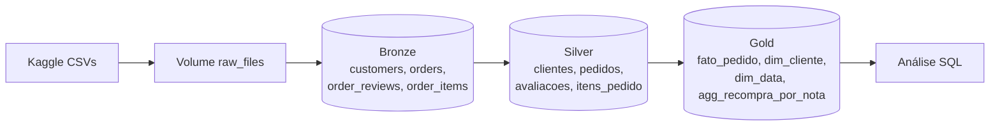
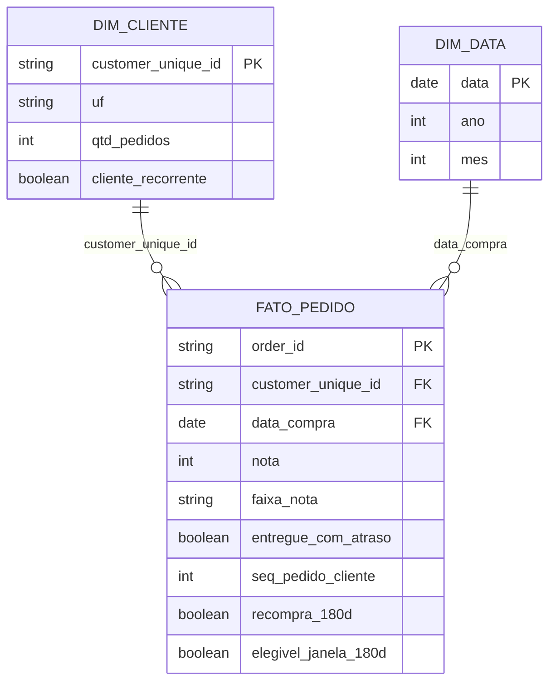

# MVP Engenharia de Dados: Avaliação x Recompra no E-commerce Olist

**Aluno:** Kellman Santana Castro e Silva  
**Curso:** Pós-graduação em Ciência de Dados e Analytics, PUC-Rio  
**Disciplina:** MVP em Engenharia de Dados  
**Repositório:** https://github.com/kellmancastro/MVP-Engenharia-de-dados

**Tecnologias:** Databricks Free Edition · Apache Spark (PySpark e SQL) · Delta Lake · Unity Catalog · GitHub

---

Pipeline de dados na nuvem (Databricks Free Edition, arquitetura medalhão) para medir **como a nota da última compra influencia a chance de o cliente comprar novamente**.

**Estrutura do repositório**

```
01_bronze_ingestao.py       -> ingestão dos CSVs (Bronze)
02_qualidade_dados.py       -> diagnóstico de qualidade
03_silver_transformacao.py  -> limpeza e padronização (Silver)
04_gold_modelagem.py        -> modelo estrela e métricas (Gold)
05_analise.sql              -> respostas às perguntas
imagens/                    -> screenshots usados neste README
README.md                   -> documentação do MVP
```

---

## 1. Contexto de Negócio e Perguntas (Etapa 2 e 4.1)

### Problema

Em e-commerce, conquistar um cliente novo custa bem mais do que manter um cliente atual. A avaliação que o cliente dá após a entrega é um dos poucos sinais diretos de satisfação disponíveis. O problema deste MVP é entender **se a nota dada no último pedido ajuda a prever se o cliente voltará a comprar**, o que permitiria à empresa agir (cupom, contato do SAC) logo após uma avaliação ruim.

### Perguntas de negócio

1. Qual é a taxa geral de recompra dos clientes da Olist?
2. **Quando a avaliação da última compra é boa (4-5), neutra (3) ou ruim (1-2), qual é a probabilidade de o cliente comprar de novo?** (pergunta principal)
3. Como a taxa de recompra varia em cada nota, de 1 a 5?
4. O resultado se mantém quando olhamos apenas a primeira compra de cada cliente?
5. Entregas atrasadas geram notas piores e menos recompra?
6. Entre os clientes que recompraram, a nota altera o tempo até a nova compra?

### Definição de "recompra"

Para cada pedido entregue (o *pedido de referência*), verifica-se se o **mesmo cliente** (`customer_unique_id`) fez um novo pedido **em uma data posterior, em até 180 dias**. Dessa forma, a nota do pedido de referência é sempre a nota da **última compra realizada até aquele momento**. Pedidos no mesmo dia não contam como recompra. Só entram no cálculo pedidos com pelo menos 180 dias de observação até o fim do dataset, para não subestimar a recompra de pedidos recentes.

### Fonte e licença dos dados

- **Dataset:** Brazilian E-Commerce Public Dataset by Olist, disponível no Kaggle: https://www.kaggle.com/datasets/olistbr/brazilian-ecommerce
- **Conteúdo:** cerca de 100 mil pedidos reais e anonimizados feitos entre 2016 e 2018 em diversos marketplaces brasileiros.
- **Licença:** CC BY-NC-SA 4.0 (uso permitido para fins não comerciais, com atribuição e compartilhamento pela mesma licença). O uso acadêmico deste trabalho está de acordo com a licença.

### Estrutura dos dados brutos utilizados

| Arquivo | Linhas (aprox.) | Colunas principais |
|---|---|---|
| olist_customers_dataset.csv | 99 mil | customer_id, customer_unique_id, customer_zip_code_prefix, customer_city, customer_state |
| olist_orders_dataset.csv | 99 mil | order_id, customer_id, order_status, order_purchase_timestamp, order_approved_at, order_delivered_carrier_date, order_delivered_customer_date, order_estimated_delivery_date |
| olist_order_reviews_dataset.csv | 99 mil | review_id, order_id, review_score, review_comment_title, review_comment_message, review_creation_date, review_answer_timestamp |
| olist_order_items_dataset.csv | 112 mil | order_id, order_item_id, product_id, seller_id, shipping_limit_date, price, freight_value |

Os demais arquivos do dataset (produtos, vendedores, pagamentos, geolocalização) não foram usados porque não são necessários para as perguntas definidas, seguindo a ideia de MVP.

---

## 2. Carga dos Dados (Etapa 4.2)

1. Download manual dos 4 CSVs no Kaggle.
2. O notebook [`01_bronze_ingestao.py`](01_bronze_ingestao.py) cria os schemas `workspace.bronze`, `workspace.silver`, `workspace.gold` e o volume `workspace.bronze.raw_files`.
3. Upload dos CSVs para o volume pela interface do Unity Catalog (Catalog > bronze > Volumes > raw_files > Upload).
4. O mesmo notebook lê cada CSV com PySpark (todas as colunas como texto, com `multiLine` e `escape` para tratar comentários com quebra de linha e aspas) e grava como tabela Delta na camada Bronze, adicionando `_ingestion_ts` e `_source_file` para rastreabilidade.


---

## 3. Modelagem e Catálogo de Dados (Etapa 4.3)

### Arquitetura



### Modelo estrela (camada Gold)



A granularidade da fato é **1 linha por pedido entregue**, pois a pergunta relaciona a nota de um pedido com o que acontece depois dele. A dimensão de cliente usa `customer_unique_id` (e não `customer_id`) porque é a única chave que identifica a mesma pessoa em pedidos diferentes.

### Catálogo de dados

Todas as descrições abaixo também estão gravadas no **Unity Catalog** (comentários de tabela e coluna), aplicados pela função `documentar()` dos notebooks 03 e 04. O grafo de linhagem gerado automaticamente pelo Unity Catalog confirma o fluxo Bronze → Silver → Gold.


#### gold.fato_pedido
Pedidos entregues com nota e indicadores de recompra. Linhagem: silver.pedidos + silver.clientes + silver.avaliacoes + silver.itens_pedido.

| Coluna | Tipo | Descrição | Domínio | Linhagem |
|---|---|---|---|---|
| order_id | string | Identificador do pedido | hash único | silver.pedidos |
| customer_unique_id | string | Identificador da pessoa | hash | silver.clientes (JOIN por customer_id) |
| dt_compra | timestamp | Data e hora da compra | 2016 a 2018 | silver.pedidos |
| data_compra | date | Data da compra (chave de dim_data) | 2016 a 2018 | derivado de dt_compra |
| nota | int | Nota da avaliação | 1 a 5 ou nulo | silver.avaliacoes |
| faixa_nota | string | Categoria da nota | Boa (4-5), Neutra (3), Ruim (1-2), nulo | derivado de nota |
| tem_comentario | boolean | Cliente escreveu comentário | true/false | silver.avaliacoes |
| qtd_itens | bigint | Itens no pedido | ≥ 1 | agregado de silver.itens_pedido |
| valor_produtos | decimal | Soma dos preços (R$) | > 0 | agregado de silver.itens_pedido |
| valor_frete | decimal | Soma do frete (R$) | ≥ 0 | agregado de silver.itens_pedido |
| dias_entrega | int | Dias entre compra e entrega | ≥ 0 | derivado de silver.pedidos |
| entregue_com_atraso | boolean | Entregue após a data prometida | true/false | derivado de silver.pedidos |
| seq_pedido_cliente | int | Ordem do pedido na história do cliente | ≥ 1 | função de janela |
| data_proxima_compra | date | Próxima compra em dia posterior | data ou nulo | função de janela |
| dias_ate_proxima_compra | int | Dias até a próxima compra | ≥ 1 ou nulo | derivado |
| teve_recompra | boolean | Comprou de novo em qualquer momento | true/false | derivado |
| recompra_180d | boolean | Comprou de novo em até 180 dias | true/false | derivado |
| elegivel_janela_180d | boolean | Pedido tem 180 dias de observação | true/false | derivado |

#### gold.dim_cliente
Uma linha por pessoa. Linhagem: gold.fato_pedido + silver.clientes.

| Coluna | Tipo | Descrição | Domínio |
|---|---|---|---|
| customer_unique_id | string | Chave da pessoa | hash único |
| cidade | string | Cidade do pedido mais recente | texto minúsculo |
| uf | string | UF do pedido mais recente | 27 siglas |
| qtd_pedidos | bigint | Total de pedidos entregues | ≥ 1 |
| qtd_dias_com_compra | bigint | Dias distintos com compra | ≥ 1 |
| cliente_recorrente | boolean | Comprou em mais de um dia | true/false |
| data_primeira_compra | date | Primeira compra | 2016 a 2018 |
| data_ultima_compra | date | Última compra | 2016 a 2018 |
| nota_primeiro_pedido | int | Nota do primeiro pedido | 1 a 5 ou nulo |
| nota_ultimo_pedido | int | Nota do último pedido | 1 a 5 ou nulo |

#### gold.dim_data
Calendário diário gerado entre a menor e a maior data de compra: `data` (date), `ano` (2016 a 2018), `trimestre` (1 a 4), `mes` (1 a 12), `ano_mes` (yyyy-MM), `dia_semana` (1 = domingo a 7 = sábado), `fim_de_semana` (boolean).

#### gold.agg_recompra_por_nota
Métrica pré-calculada a partir de gold.fato_pedido (somente pedidos elegíveis e avaliados): `nota` (1 a 5), `faixa_nota`, `pedidos_referencia`, `pedidos_com_recompra`, `pct_recompra_180d` (0 a 100).

#### Camada Silver (resumo)

| Tabela | Granularidade | Origem | Colunas |
|---|---|---|---|
| silver.clientes | 1 por customer_id | bronze.customers | customer_id, customer_unique_id, cep_prefixo, cidade, uf |
| silver.pedidos | 1 por order_id | bronze.orders | order_id, customer_id, status, dt_compra, dt_aprovacao, dt_envio_transportadora, dt_entrega, dt_entrega_estimada |
| silver.avaliacoes | 1 por order_id | bronze.order_reviews | review_id, order_id, nota, titulo_comentario, comentario, tem_comentario, dt_envio_pesquisa, dt_resposta |
| silver.itens_pedido | 1 por (order_id, item_seq) | bronze.order_items | order_id, item_seq, product_id, seller_id, preco, frete |

---

## 4. Pipeline de Dados (Etapa 4.4)

O pipeline foi dividido em **um notebook por etapa**, executados em sequência (01 → 05). Todos os scripts estão neste repositório, sincronizado com o Databricks via Git folder (Databricks Repos).

| Notebook | Entrada | Saída | O que faz e por quê |
|---|---|---|---|
| 01_bronze_ingestao | CSVs no volume | 4 tabelas bronze | Grava o dado exatamente como chegou, apenas com metadados de carga, para preservar rastreabilidade |
| 02_qualidade_dados | tabelas bronze | relatórios | Mede nulos, duplicatas, domínios, datas e outliers para decidir as regras da Silver |
| 03_silver_transformacao | tabelas bronze | 4 tabelas silver | Tipagem com TRY_CAST, padronização de texto, deduplicação com QUALIFY/ROW_NUMBER e filtro de valores inválidos |
| 04_gold_modelagem | tabelas silver | fato, 2 dimensões e 1 agregado | JOIN de pedidos com clientes para obter o customer_unique_id, JOIN com avaliações para trazer a nota, agregação dos itens por pedido e funções de janela para identificar a próxima compra de cada cliente |
| 05_analise | tabelas gold | respostas | Consultas SQL para cada pergunta de negócio |

Principais transformações documentadas:

- **JOIN pedidos × clientes por `customer_id`** para trazer o `customer_unique_id`, sem o qual não é possível identificar recompra.
- **JOIN pedidos × avaliações por `order_id`** para associar cada compra à sua nota.
- **Agregação de itens por `order_id`** para obter valor e quantidade de itens do pedido.
- **Função de janela `MIN(data_compra) OVER (... RANGE BETWEEN 1 FOLLOWING ...)`** para encontrar a próxima compra do cliente em uma data posterior.
- **Filtro `status = 'delivered'`** na fato, pois só pedidos entregues podem ser avaliados de forma justa.


---

## 5. Qualidade de Dados (Etapa 4.5)

Diagnóstico feito no notebook `02_qualidade_dados` e validado ao final do `03_silver_transformacao`.

| Verificação | Problema encontrado | Tratamento |
|---|---|---|
| Completude | Grande parte das avaliações não tem comentário escrito; datas de aprovação e entrega nulas em pedidos não entregues (ver print de nulos) | Comentários vazios viraram nulo e flag `tem_comentario`; datas nulas mantidas (são esperadas) e a fato usa apenas pedidos entregues |
| Unicidade | Pedidos com mais de uma avaliação e `review_id` repetido (ver print de duplicatas) | Mantida apenas a avaliação mais recente de cada pedido |
| Consistência de chave | Quantidade de `customer_id` maior que a de `customer_unique_id`: um `customer_id` novo é gerado a cada pedido | Toda análise de recompra usa `customer_unique_id` |
| Domínio | Status em 8 categorias; notas verificadas no intervalo de 1 a 5 | Status padronizado em minúsculas; filtro de notas fora de 1 a 5 mantido como proteção |
| Acurácia de datas | Pedidos com status entregue sem data de entrega preenchida | Atraso fica nulo nesses casos e é excluído da P5 |
| Integridade | Pedidos sem avaliação correspondente | Mantidos na fato com nota nula e excluídos das métricas por nota |
| Outliers | Preço máximo muito acima da mediana dos itens | Mantidos (vendas reais de itens caros) e sem impacto na métrica de recompra, que não usa preço |
| Tipagem | Todas as colunas chegam como texto | TRY_CAST para timestamp, int e decimal |
| Censura temporal | Pedidos recentes não tiveram tempo de gerar recompra | Janela de observação de 180 dias (`elegivel_janela_180d`) |


---

## 6. Análise de Dados (Etapa 4.5)

Consultas no notebook [`05_analise.sql`](05_analise.sql).

### P1. Qual é a taxa geral de recompra?

Dos 93.358 clientes com pedido entregue, 2.015 compraram em mais de um dia, o que representa **2,16%** da base. A recompra é rara na Olist, comportamento esperado para um marketplace de compras esporádicas e sem programa de fidelidade. Por isso, nas próximas perguntas, as diferenças entre faixas de nota devem ser lidas também em termos relativos (quantas vezes maior é a chance), e não apenas em pontos percentuais.


### P2. Quando a última avaliação é boa, neutra ou ruim, qual é a chance de recompra em 180 dias? (pergunta principal)

| Faixa da nota | Pedidos de referência | Com recompra | % recompra | IC 95% |
|---|---|---|---|---|
| Boa (4-5) | 44.769 | 1.022 | 2,28% | 2,14% a 2,42% |
| Neutra (3) | 5.015 | 116 | 2,31% | 1,90% a 2,73% |
| Ruim (1-2) | 7.625 | 139 | 1,82% | 1,52% a 2,12% |


A nota da última compra influencia a recompra, mas de forma limitada. Clientes que avaliaram bem voltaram a comprar em 2,28% dos casos, contra 1,82% dos que avaliaram mal, uma chance cerca de 25% maior. A diferença é estatisticamente relevante, já que os intervalos de confiança não se sobrepõem, porém a margem é estreita e o ganho absoluto é de menos de meio ponto percentual. A faixa neutra apresentou taxa semelhante à boa, mas com intervalo amplo por ter poucos pedidos, o que impede conclusões sobre ela.

Mesmo entre os clientes satisfeitos, cerca de 98% não recompraram em 180 dias. A satisfação é uma condição necessária, mas não suficiente, para o cliente voltar.

### P3. Como a recompra varia em cada nota, de 1 a 5?

| Nota | Pedidos de referência | Com recompra | % recompra |
|---|---|---|---|
| 1 | 5.788 | 108 | 1,87% |
| 2 | 1.837 | 31 | 1,69% |
| 3 | 5.015 | 116 | 2,31% |
| 4 | 11.470 | 227 | 1,98% |
| 5 | 33.299 | 795 | 2,39% |


A relação não é linear: a nota 4 (1,98%) ficou abaixo da nota 3 (2,31%), e a nota 2 abaixo da nota 1. Parte dessa oscilação se explica pelo tamanho das amostras, já que as notas 2 e 3 têm poucos pedidos e, portanto, taxas mais instáveis. O contraste mais claro está nos extremos: a nota 5 tem a maior taxa (2,39%), cerca de 28% acima da nota 1 e 41% acima da nota 2. Isso sugere que o sinal mais útil para o negócio é o cliente **plenamente satisfeito** (nota 5) em comparação com os demais, já que a própria nota 4 se comporta de forma parecida com as notas baixas.

### P4. O resultado se mantém olhando só a primeira compra de cada cliente?

| Faixa da nota | Clientes | % recompra |
|---|---|---|
| Boa (4-5) | 43.362 | 2,04% |
| Neutra (3) | 4.866 | 1,95% |
| Ruim (1-2) | 7.391 | 1,68% |


Sim. Contando cada cliente uma única vez, a faixa boa continua acima da ruim (2,04% contra 1,68%, uma chance cerca de 21% maior), e a faixa neutra agora fica entre as duas, na ordem esperada. As taxas são um pouco menores que na P2 porque a P2 também inclui pedidos de clientes que já eram recorrentes, e esses clientes tendem a comprar novamente com mais frequência. A checagem confirma que a conclusão da P2 é robusta à forma de contar.

### P5. Entregas atrasadas geram notas piores e menos recompra?

| Entrega | Pedidos | Nota média | % nota ruim | % recompra |
|---|---|---|---|---|
| No prazo | 53.566 | 4,27 | 9,55% | 2,25% |
| Com atraso | 3.841 | 2,18 | 65,35% | 1,87% |


Este foi o resultado mais forte do trabalho. O atraso derruba a nota média em cerca de 2 pontos (de 4,27 para 2,18), e a proporção de notas ruins é quase 7 vezes maior nos pedidos atrasados (65,35% contra 9,55%). A recompra também cai, de 2,25% para 1,87%, cerca de 17% a menos. Isso indica que boa parte das avaliações ruins nasce na logística, e não no produto: **cumprir o prazo de entrega é a alavanca mais concreta** para melhorar a satisfação e, indiretamente, a recompra.

### P6. Entre quem recomprou, a nota muda o tempo até a nova compra?

| Faixa da nota | Recompras | Média de dias | Mediana de dias |
|---|---|---|---|
| Boa (4-5) | 1.428 | 58,1 | 43 |
| Neutra (3) | 147 | 63,0 | 44 |
| Ruim (1-2) | 184 | 64,0 | 50 |


Clientes satisfeitos voltam um pouco mais rápido: a mediana é de 43 dias para nota boa, contra 50 dias para nota ruim. A diferença é pequena e as faixas neutra e ruim têm poucas observações, então o resultado é apenas indicativo. Do ponto de vista prático, o dado mais útil é que metade das recompras acontece em até cerca de 45 dias, o que define a janela ideal para ações de retenção. Esta consulta considera todas as recompras em até 180 dias, inclusive de pedidos fora da janela de elegibilidade, por isso os totais diferem da P2.

### Discussão geral

O objetivo do MVP era entender se a nota da última compra ajuda a prever se o cliente voltará a comprar. A resposta é sim, mas com efeito modesto. Clientes que avaliam bem recompram cerca de 20% a 25% mais do que os que avaliam mal, e esse padrão se manteve nas diferentes formas de medir (P2 e P4). Ainda assim, a recompra é baixa em todas as faixas, em torno de 2%, o que mostra que a satisfação sozinha não transforma um comprador ocasional em um cliente recorrente.

O achado mais relevante veio da P5: o atraso na entrega é o principal gerador de notas ruins e também reduz a recompra. Isso conecta as perguntas: logística ruim gera insatisfação, e a insatisfação reduz a chance de retorno.

Com base nos resultados, as recomendações para o negócio são:

1. Priorizar o cumprimento do prazo de entrega, pois é a causa mais clara de avaliações ruins.
2. Usar a avaliação ruim como gatilho de contato do atendimento, já que é um grupo pequeno e identificável logo após a entrega.
3. Concentrar ações de retenção nos primeiros 45 dias após a compra, período em que metade das recompras acontece.
4. Criar mecanismos de fidelização (cupons, programa de pontos), já que mesmo clientes satisfeitos raramente voltam por conta própria.

É importante lembrar que esta é uma análise de correlação, não de causalidade. A nota pode refletir outros fatores que também influenciam a recompra, como categoria do produto, região e preço. Um teste A/B seria o caminho para medir o efeito real das ações sugeridas.

---

## 7. Autoavaliação

**Objetivos atingidos.** Consegui construir o pipeline completo na nuvem, da ingestão dos dados brutos até a camada Gold, seguindo a arquitetura medalhão no Databricks e documentando as tabelas no Unity Catalog. As seis perguntas definidas no objetivo foram respondidas, incluindo a pergunta principal sobre a relação entre a nota da última compra e a recompra. Também incluí intervalos de confiança e uma checagem de robustez (P4), para não depender apenas da comparação direta de percentuais.

**Dificuldades.** A principal dificuldade conceitual foi perceber que o `customer_id` do dataset muda a cada pedido. Sem usar o `customer_unique_id`, a recompra seria sempre zero. Também foi necessário definir uma regra justa de recompra: usar a nota do último pedido "até aquele momento" e aplicar uma janela de 180 dias, para não penalizar pedidos recentes que ainda não tiveram tempo de gerar uma nova compra. Na parte técnica, enfrentei a leitura do CSV de avaliações, que tem comentários com quebras de linha e aspas, um erro do Spark ao combinar várias subconsultas `NOT EXISTS` (resolvido com `LEFT ANTI JOIN`) e a configuração do ambiente: diferença entre pasta do Workspace e Volume do Unity Catalog, e conexão do Git folder com o GitHub.

**Limitações.** A recompra no dataset é muito baixa, o que reduz o tamanho das amostras e aumenta a incerteza, principalmente nas notas 2 e 3. Em alguns casos, a avaliação pode ter sido respondida depois da compra seguinte. Os dados cobrem apenas 2016 a 2018 e um único marketplace, o que limita a generalização. Por fim, a análise é descritiva e não isola outros fatores que influenciam a recompra.

**Trabalhos futuros.** Incluir as tabelas de produtos, pagamentos e vendedores para analisar a recompra por categoria e por forma de pagamento; aplicar análise de sentimento aos comentários das avaliações; construir um modelo preditivo de recompra; automatizar o pipeline com Databricks Jobs e carga incremental; e criar um dashboard no Databricks para acompanhar os indicadores.
